# 🚗 Luxora Motors
# Premium Car Dealership Inventory Management System


---

# 📌 Overview

Luxora Motors is a full-stack Car Dealership Inventory Management System developed using **Spring Boot**, **React**, **JWT Authentication**, and **SQLite**.

The application enables customers to browse premium vehicles, search vehicles, purchase available cars, and allows administrators to securely manage inventory through a role-based dashboard.

The project demonstrates modern full-stack development practices including:

- RESTful API Development
- JWT Authentication
- Role-Based Authorization
- CRUD Operations
- Responsive UI Design
- Database Integration
- Clean Architecture
- Git Version Control

---

# ✨ Features

## 👤 Authentication

- User Registration
- User Login
- JWT Authentication
- BCrypt Password Encryption
- Role-Based Authorization
- Protected Routes
- Automatic Login Session

---

## 🚘 Vehicle Management

- View All Vehicles
- Search Vehicles
- Filter Vehicles
- View Vehicle Details
- Vehicle Cards
- Stock Availability Indicator

---

## 🛒 Inventory Management

- Purchase Vehicle
- Automatic Stock Reduction
- Restock Vehicles (Admin)
- Add New Vehicle
- Edit Vehicle Details
- Delete Vehicle

---

## 👨‍💼 Admin Dashboard

- Dashboard
- Vehicle Management
- Inventory Management
- Stock Updates
- Secure Admin Access

---

## 🎨 User Interface

- Responsive Design
- Premium Dashboard
- Bootstrap UI
- Toast Notifications
- Confirmation Dialogs
- Loading Indicators
- Responsive Navbar
- Modern Vehicle Cards

---

# 🛠 Tech Stack

## Frontend

- React 19
- Vite
- React Router
- Axios
- Bootstrap 5
- CSS3

---

## Backend

- Java 21
- Spring Boot 3
- Spring Security
- Spring Data JPA
- JWT Authentication
- Maven

---

## Database

- SQLite

---

## Development Tools

- IntelliJ IDEA
- VS Code
- Git
- GitHub
- Postman

---

# 📁 Project Structure

```
Luxora-Motors
│
├── car_dealership_backend
│   ├── src
│   ├── pom.xml
│   └── ...
│
├── car_dealership_frontend
│   ├── src
│   ├── package.json
│   └── ...
│
├── screenshots
│
└── README.md
```

---

# 🚀 Getting Started

## Clone Repository

```bash
git clone https://github.com/priyanka251205/Car-Dealership-Inventory-System.git

cd Car-Dealership-Inventory-System
```

---

# Backend Setup

```bash
cd car_dealership_backend

mvn clean install

mvn spring-boot:run
```

Backend runs at:

```
http://localhost:8080
```

---

# Frontend Setup

```bash
cd car_dealership_frontend

npm install

npm run dev
```

Frontend runs at:

```
http://localhost:5173
```

---

# 🔐 Authentication

The application uses JWT Authentication.

Two roles are supported:

- USER
- ADMIN

Protected APIs require a valid JWT token.

---

# 📡 REST API Endpoints

## Authentication

| Method | Endpoint |
|---------|----------|
| POST | /api/auth/register |
| POST | /api/auth/login |

---

## Vehicles

| Method | Endpoint |
|---------|----------|
| GET | /api/vehicles |
| GET | /api/vehicles/search |
| POST | /api/vehicles |
| PUT | /api/vehicles/{id} |
| DELETE | /api/vehicles/{id} |

---

## Inventory

| Method | Endpoint |
|---------|----------|
| POST | /api/vehicles/{id}/purchase |
| POST | /api/vehicles/{id}/restock |

---

# 📸 Application Screenshots

## 🔐 Login Page

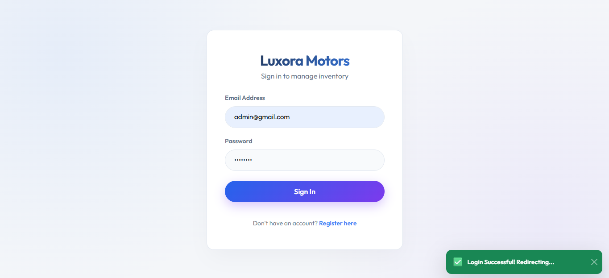

---

## 📝 Register Page

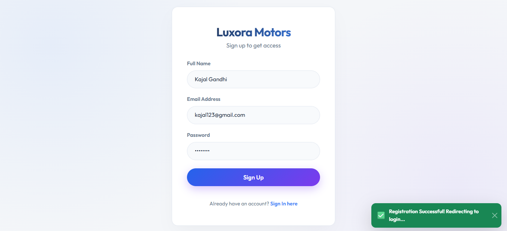

---

## 👤 User Dashboard

### Dashboard View 1

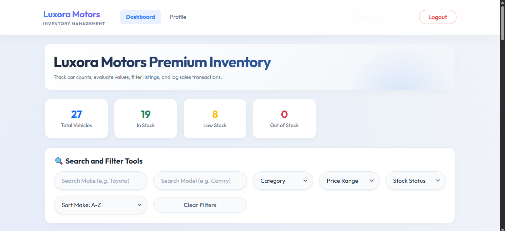

### Dashboard View 2

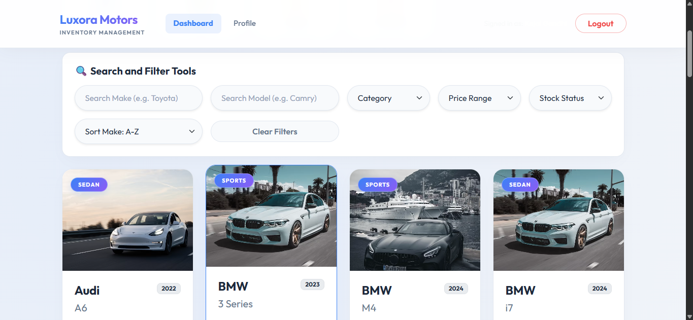

### Dashboard View 3

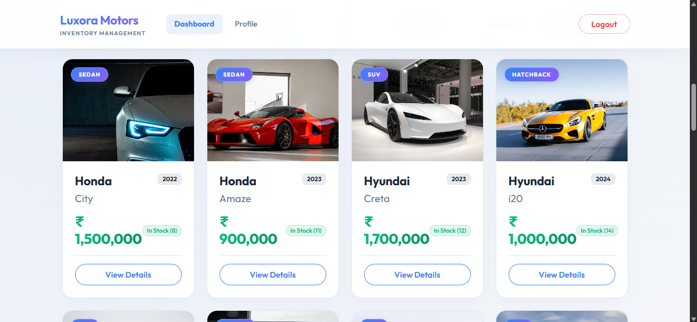

---

## 🚗 Vehicle Cards (User)

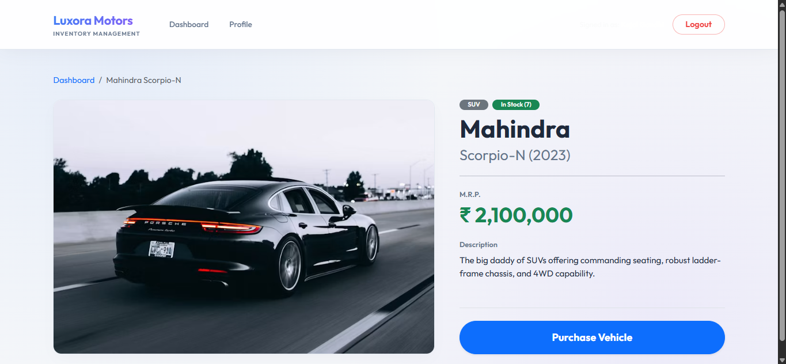

---

## 🛒 Purchase Invoice

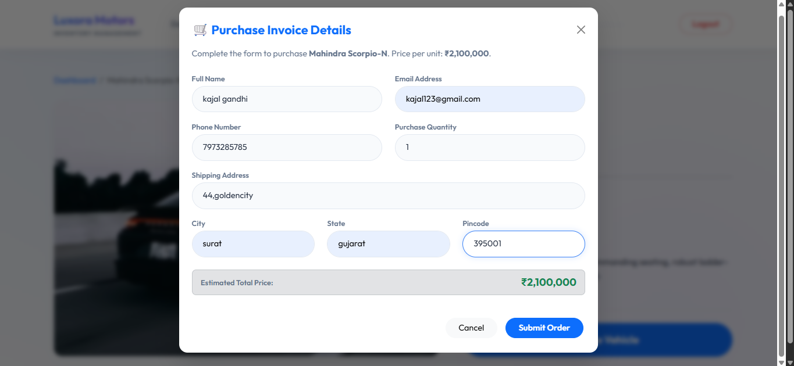

---

## 👤 User Profile

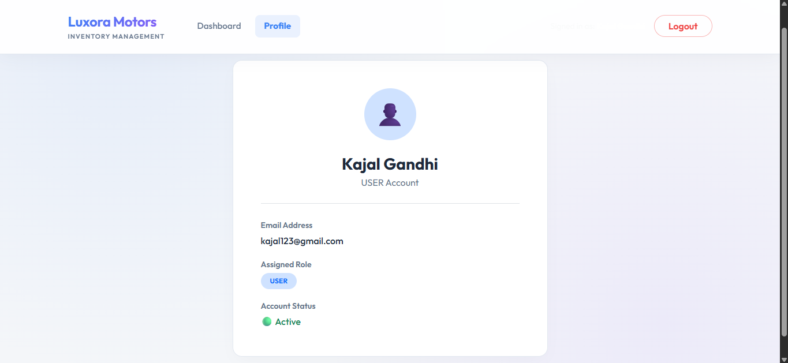

---

## 👨‍💼 Admin Dashboard

### Dashboard View 1

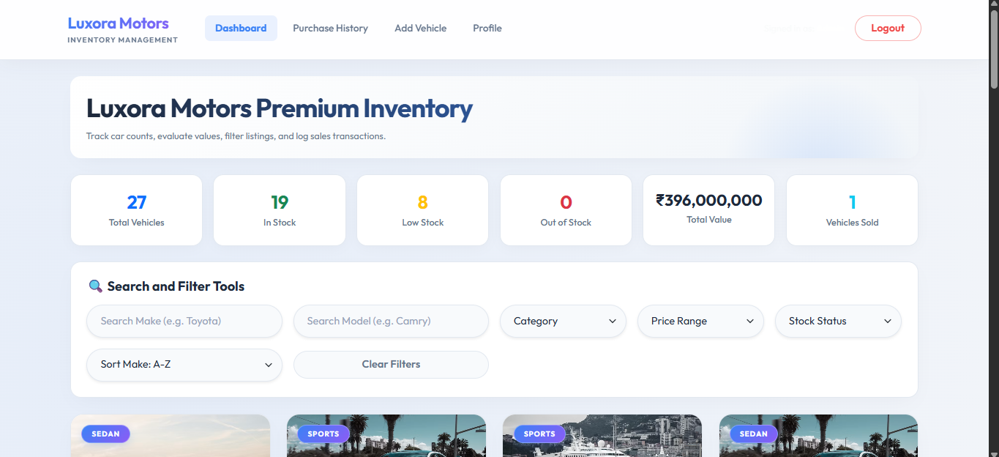

### Dashboard View 2

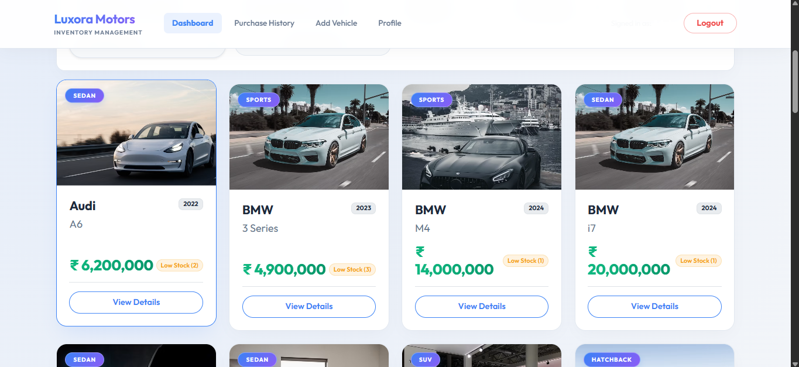

---

## 🚘 Vehicle Card (Admin)

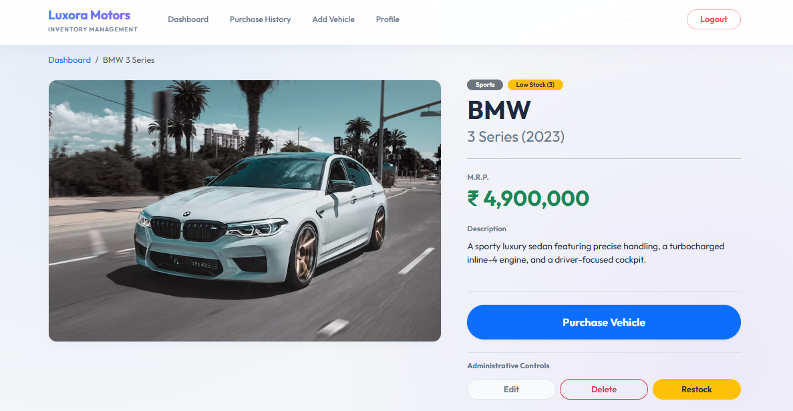

---

## 🗑️ Delete Vehicle

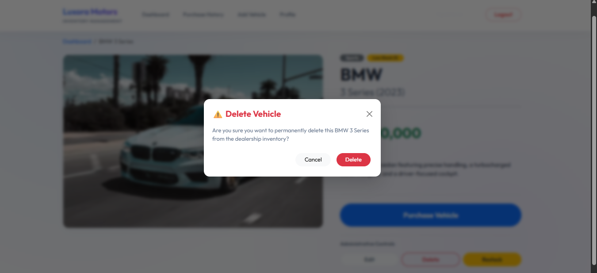

---

## ✏️ Edit Vehicle

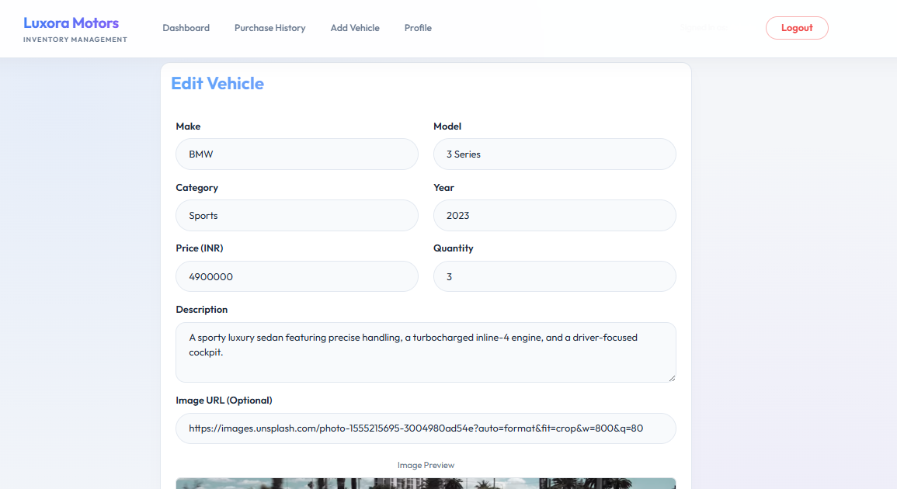

---

## 📦 Restock Vehicle

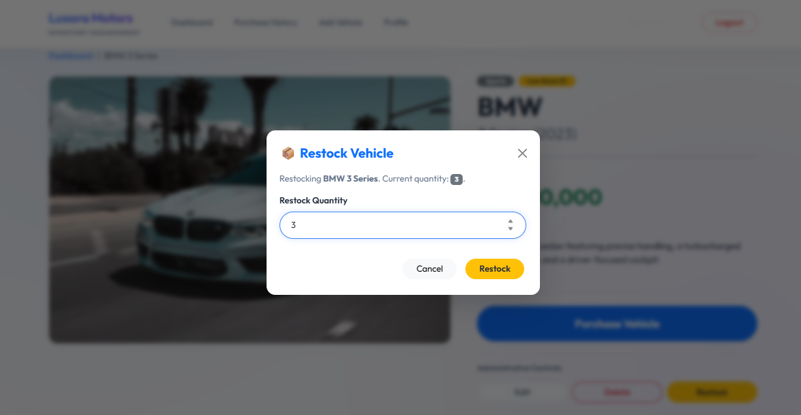

---

## 📜 Purchase History

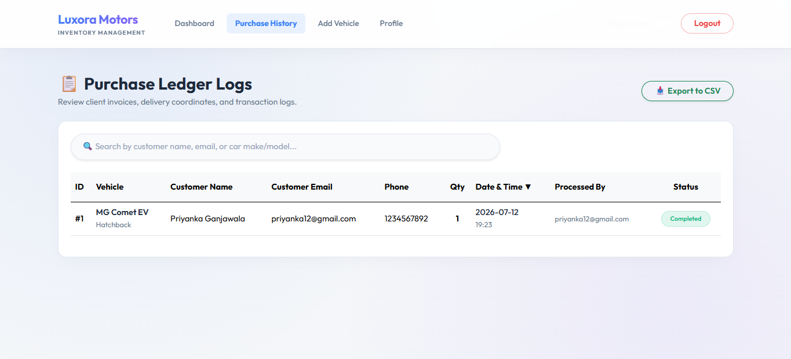

---

## ➕ Add Vehicle

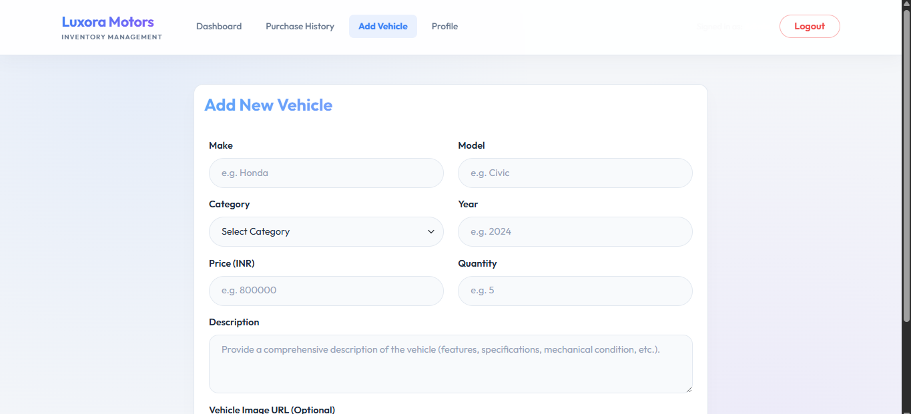

---

## 👤 Admin Profile

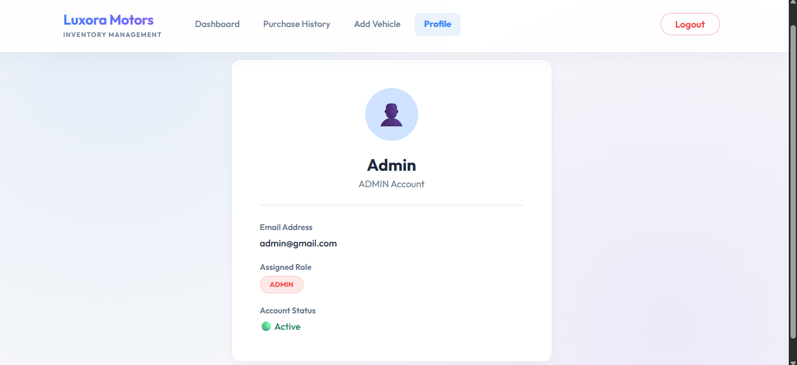

---

# 🤖 My AI Usage

AI tools were used responsibly during the development of this project to improve productivity while ensuring all code was reviewed, understood, modified where necessary, and tested manually.

## AI Tools Used

- ChatGPT (OpenAI)
- AntiGravity

## How AI Was Used

- Assisted in designing the project architecture.
- Generated initial boilerplate code for Spring Boot and React components.
- Helped design REST API endpoints.
- Assisted in implementing JWT authentication and Spring Security configuration.
- Suggested improvements for React component structure and UI design.
- Helped debug backend and frontend integration issues.
- Assisted in writing SQL queries and repository methods.
- Provided guidance for Git commands, merge conflict resolution, and project organization.
- Helped improve the README documentation and project structure.

## Reflection

AI significantly improved development speed by assisting with repetitive tasks, debugging, and code organization. Every AI-generated suggestion was reviewed, customized, and validated before being incorporated into the project. Using AI allowed me to focus more on understanding the business logic, improving the user experience, and writing maintainable code while maintaining full ownership of the final implementation.

---

# 🧪 Testing

The application was tested using:

- Postman (Backend API Testing)
- Manual Frontend Testing

### Verified Functionalities

- User Registration
- User Login
- JWT Authentication
- Add Vehicle
- Edit Vehicle
- Delete Vehicle
- Search Vehicle
- Purchase Vehicle
- Restock Vehicle
- Role-Based Authorization
- Protected Routes

---

# 📊 Test Report

All implemented functionalities were tested successfully.

| Module | Status |
|---------|--------|
| Authentication | ✅ Passed |
| Vehicle CRUD | ✅ Passed |
| Search | ✅ Passed |
| Purchase | ✅ Passed |
| Restock | ✅ Passed |
| Admin Access | ✅ Passed |
| JWT Security | ✅ Passed |

---

# 🚀 Future Enhancements

- Vehicle Image Upload
- Cloud Database Support
- Email Notifications
- Payment Gateway Integration
- Vehicle Reservation System
- Analytics Dashboard
- Docker Deployment
- CI/CD Pipeline

---

# 👩‍💻 Author

**Priyanka Ganjawala**

GitHub:

https://github.com/priyanka251205

---

# 📄 License

This project is developed for educational purposes as part of the **Incubyte Software Craftsperson Internship Assignment**.
